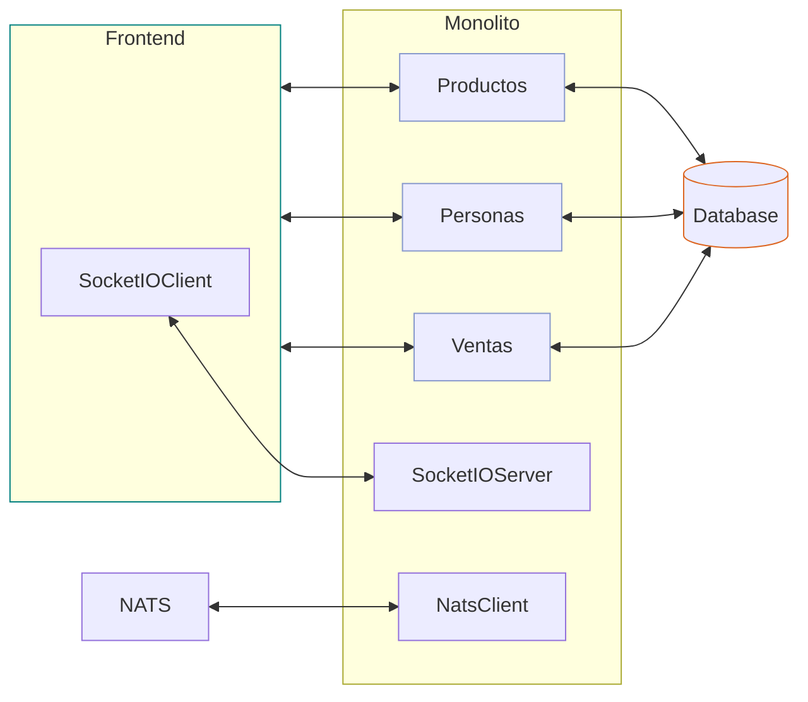
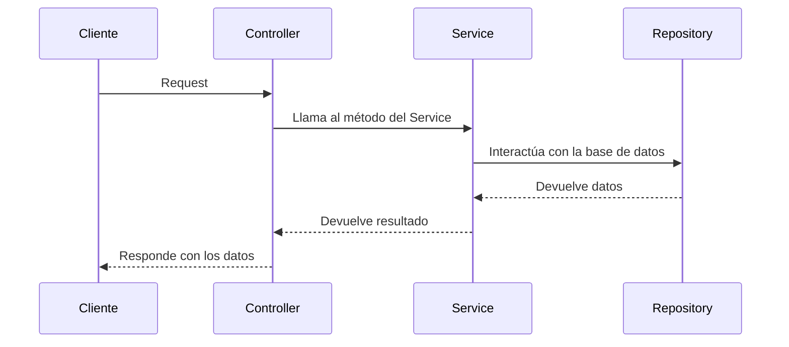

# Tienda211 - Spring Boot


## Run

```sh
# Requiere NATS server
docker run -p 4222:4222 -ti nats:latest

mvn clean install
mvn spring-boot:run
mvn spring-boot:run -Dspring.profiles.active=dev
mvn test -Dspring.profiles.active=test
```

http://localhost:8080/


## Sobre la numeración de los proyectos relacionados

- 101: frontend simple - backend monolito
	- [akobashikawa/tienda101-springboot: Ejercicio de implementar una tienda. Spring Boot. BDD. Arquitectura Hexagonal. Monolito.](https://github.com/akobashikawa/tienda101-springboot)
- 102: simple - monolito con eventos
	- [akobashikawa/tienda102-springboot: Ejercicio de implementar una tienda. Spring Boot. BDD. Arquitectura Hexagonal. Monolito con Eventos.](https://github.com/akobashikawa/tienda102-springboot)
- 111: simple - nats - monolito (antes 103)
- 211: socketIO - nats - monolito (antes 104)
- 2111: socketIO - nats - gateway - monolito
- 2113: socketIO - nats - gateway - microservices


## Monolito con NATS y SocketIO (211)



- Incluye todos los servicios


## Capas

- Un router invoca a controllers
- Un controller invoca services
- Un service invoca repositories y otros services
- Un repository usa models

- Los routers y controllers son parte de la interface web de usuario
- Puede haber equivalentes para interface de consola y otros
- Los repositories son parte de la interface de datos
- Los services contienen la business logic
- Los services idealmente son agnósticos a la interface de usuario y a la interface de datos




## Hexagonal

- Esta arquitectura se conoce también como **Ports and Adapters**.

- La idea es organizar el código en capas que faciliten:
    - Entender de qué se trata la solución
        - Que entidades participan
        - Qué eventos ocurren
    - Probar cada capa por separado
        - Testing de endpoints
        - Testing de services
    - Correr la misma lógica en diversos contextos
        - Web
        - Consola
        - Testing
    - Migrar la misma lógica a diversos contextos
        - Otra versión del framework
        - Otro framework
        - Otro lenguaje

- El lugar de agrupar los componentes por tipo (controllers, services, repositories), se agrupan por tópicos (productos, personas, ventas).

- Dentro de cada tópico van los controllers, services, repositories, etc relacionados con el tópico pero agrupados según su funcionalidad.

- `domain` es para contener lo conceptual, independientemente de su soporte, como el modelo de datos.

- `application` es para contener la lógica del negocio, independientemente de dónde se vaya a usar, como los services, DTOs, events, listeners, etc.

- `infrastructure` es para contener lo que relaciona la aplicación con el mundo exterior, como los controllers, la implementación de los repositories, configuraciones, conexión a servicios externos, etc.

## Pruebas


### curl

```sh
# get all productos
curl http://localhost:8080/api/productos

# create producto
curl -X POST http://localhost:8080/api/productos -H "Content-Type: application/json" -d '{"nombre": "Producto Nuevo", "precio": 15, "costo": 10, "cantidad": 10}'

# get producto
curl http://localhost:8080/api/productos/1

# update producto
curl -X PUT http://localhost:8080/api/productos/1 -H "Content-Type: application/json" -d '{"nombre": "Producto Actualizado", "precio": 20, "costo": 10, "cantidad": 5}'

curl -X PUT http://localhost:8080/api/productos/1 -H "Content-Type: application/json" -d '{"cantidad": 6}'

# delete producto
curl -X DELETE http://localhost:8080/api/productos/1


# get all personas
curl http://localhost:8080/api/personas

# create persona
curl -X POST http://localhost:8080/api/personas -H "Content-Type: application/json" -d '{"nombre": "Ana"}'

# get persona
curl http://localhost:8080/api/personas/1

# update persona
curl -X PUT http://localhost:8080/api/personas/1 -H "Content-Type: application/json" -d '{"nombre": "Betty"}'

# delete persona
curl -X DELETE http://localhost:8080/api/personas/1


# get all ventas
curl http://localhost:8080/api/ventas

# create venta
curl -X POST http://localhost:8080/api/ventas -H "Content-Type: application/json" -d '{"persona_id": 1, "producto_id": 1, "precio": 15, "cantidad": 1}'

# update venta
curl -X PUT http://localhost:8080/api/ventas/1 -H "Content-Type: application/json" -d '{"persona_id": 1, "producto_id": 1, "precio": 15, "cantidad": 3}'

```

